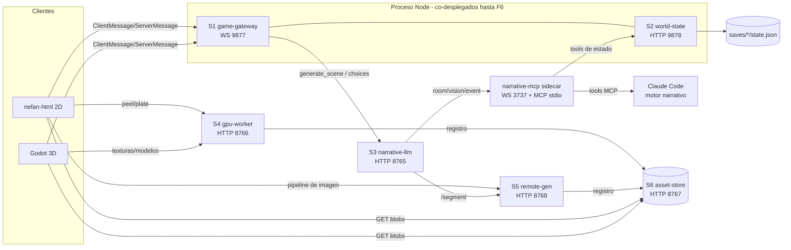

# Arquitectura de microservicios de ne-fan

División del monolito (bridge Node + narrative-mcp + ai_server Python) en
**6 microservicios + 1 librería compartida**, como objetivo real a medio
plazo. Los contratos de TODOS los servicios (endpoints tipados, incluidos los
de implementación Python) viven en **`nefan-core/src/contracts/`** — ese
paquete es la fuente de verdad del wire; este documento es la vista de
arquitectura. Las fases de extracción están en [migration.md](migration.md) y
las decisiones en [decisions.md](decisions.md).

## Los servicios

| # | Servicio | Responsabilidad | Protocolo | Puerto objetivo (hoy) | Contrato |
|---|----------|-----------------|-----------|----------------------|----------|
| S1 | **game-gateway** | Sesiones en vivo: WS con clientes, routing, `GameSimulation` (hot loop) y `SceneGenQueue` in-process | WS | 9877 (9877) | `contracts/gateway.ts` |
| S2 | **world-state** | Fuente de verdad del mundo: `NarrativeState` (único escritor de saves), `WorldMapManager`, `NpcDirector`, plugins runtime | HTTP | 9878 (9878, mismo proceso que S1) | `contracts/world-state.ts` |
| S3 | **narrative-llm** | Narrativa LLM: generate_scene, choices, develop_world, reviews con visión; narrative-mcp (:3737) como sidecar | HTTP + WS | 8765 (8765) | `contracts/narrative-llm.ts`, `contracts/narrative-mcp-ws.ts` |
| S4 | **gpu-worker** | Generación local con GPU: SD1.5 (texturas/skins/sprites), TripoSG, LaMa. 1 proceso = 1 GPU | HTTP | **8766 (extraído en F3** — `ai_server/gpu_worker_main.py`; ai_server proxya los endpoints GPU para Godot**)** | `contracts/gpu-worker.ts` |
| S5 | **remote-gen** | Adaptador Meshy/fal: scene images, sprite sheets, style packs, segmentación SAM2 | HTTP | **8768 (extraído en F4** — `ai_server/remote_gen_main.py`; sin proxy, los clientes HTML resuelven por serviceUrl**)** | `contracts/remote-gen.ts` |
| S6 | **asset-store** | Blobs content-addressed + manifest SQLite + styles binarios | HTTP | **8767 (extraído en F2** — `nefan-core/services/asset-store/`; ai_server proxya `/cache\|/assets` para Godot**)** | `contracts/asset-store.ts` |
| — | **@nefan/core** (librería) | Lógica pura compartida: combate/registry, `formatDToWorld`, compositores blueprint/stage, colisión, `GameStore`, tipos | import | — | — |

Dos ciclos (sin cambios respecto a hoy):
- **Ciclo de generación**: gateway → narrative-llm → narrative-mcp → Claude Code.
- **Ciclo de estado**: Claude Code → narrative-mcp (tools) → world-state.

## Justificación de fronteras

- **game-gateway vs world-state**: el hot loop (`input` → tick → `state_update`)
  necesita latencia cero con el socket; el estado canónico necesita
  durabilidad y UN solo escritor. Regímenes distintos → contratos distintos.
  PERO se quedan co-desplegados en el mismo proceso Node hasta F6 (opcional):
  la frontera se materializa primero como contrato TS + inyección de
  dependencias, no como red.
- **La simulación NO es un servicio**: extraerla añadiría un hop de red al
  camino más caliente del juego. Igual la `SceneGenQueue`: sus prioridades
  (blocking/prefetch) dependen de dónde está el jugador, información que vive
  en el gateway.
- **narrative-llm + narrative-mcp = un servicio lógico, dos procesos**: el
  ciclo por WS :3737 es acoplamiento de despliegue total (si uno cae, el otro
  no sirve). Los endpoints de visión (`/analyze_scene_image`,
  `/review_stage_image`) van aquí porque necesitan el canal MCP; la llamada
  SAM2 se delega en remote-gen (`/segment`, F4).
- **gpu-worker vs remote-gen**: separar lo que consume GPU local (escala = nº
  de GPUs, serializado por naturaleza) de lo que consume dinero (escala =
  concurrencia HTTP, latencias 30–300 s). El `gpu_lock` de asyncio NO
  desaparece dentro del worker (F3): además de CUDA protege la coherencia del
  pipe SD compartido que Skin/Sprite/ModelGenerator mutan y restauran; lo que
  muere es compartirlo con los endpoints narrativos.
- **asset-store primero (F2)**: es la única pieza que TODOS los generadores
  escriben y TODOS los clientes leen. `cache/manifest.json` (~5,8 MB,
  reescrito entero en cada registro, ~17k entradas) no soporta escrituras
  concurrentes — hasta que no migre a SQLite no se puede partir nada más.
- **@nefan/core como librería, no servicio**: el cliente HTML importa la
  lógica pura in-process (alias Vite) y eso es CORRECTO — colisión, compositores
  y render no deben cruzar la red. La línea divisoria dentro de nefan-core:
  `src/{types,vec3,rng,config,store,combat,simulation,animation,scene,world-map,plugins,narrative(sin storage),protocol,systems}` = librería pura;
  `src/narrative/{session-storage,asset-index,ai-client}`, `src/games/loader`,
  `src/plugins/loader`, `src/dev/*` y `bridge/**` = solo servidor.

## Invariantes (sobreviven a cualquier fase)

1. **Un solo escritor del save**: world-state (hoy, el bridge). Nadie más toca
   `saves/{id}/state.json`.
2. **La escena viaja normalizada**: Format D se persiste; por el wire a
   clientes va SIEMPRE world scene (`formatDToWorld`). Godot hace push_error
   ante Format D crudo.
3. **Colisión desde huellas declaradas o de segmentar lo PINTADO — nunca de
   recortar con siluetas declaradas** (regla del proyecto, ver CLAUDE.md).
4. **Assets content-addressed**: clave sha256(prompt+context)[:16]; los
   contexts llevan la versión de pipeline (pipeline=, schema=, algo=, model=)
   que invalida caché a propósito. Los saves referencian por hash
   (`asset_refs`) — el cruce save↔manifest es un contrato explícito
   (`/assets/by_hash`, y en F2 la keep-list `/sessions/asset_refs`).
5. **Fail-loud uniforme**: Node → `ErrorResponse {ok:false, error}`; FastAPI →
   `HTTPException {detail}` (nunca error con 200 OK).
6. **Orden de rutas del cache**: `/cache/{kind}/{hash}` se registra ANTES que
   `/cache/check/{hash}` — contrato observable a preservar en cualquier
   reimplementación.

## Mapa endpoint → servicio (cobertura completa)

Checklist contra el inventario del monolito (2026-08-04). ✅ = tipado en
contracts; 🆕 = endpoint nuevo planificado; ☠ = deprecado.

**S1 game-gateway (WS :9877)** — ✅ los `ClientMessage` de juego (input, load_room,
respawn, ping, list_sessions, start_session, resume_session, delete_session,
dialogue_choice, create_game, list_games, save_session, player_entered_place,
request_tile, tile_analysis, map_plan_update, add_combatants, interact_entity)
y los 10 `ServerMessage` (state_update, pong, sessions_listed, session_started,
narrative_event, narrative_status, games_listed, game_created, session_deleted,
session_saved).

**S2 world-state (HTTP :9878)** — ✅ /health, /map, /map/place/{id},
POST /map/place, POST /map/link, POST /map/trigger, /entities, /entity/{id},
GET+POST /entity/{id}/inventory, POST /entity/{id}/inventory/remove,
/world_doc, /ui_doc, POST /scene/validate, /plugins,
/plugins/{id}/inspect, POST /plugins/register, POST /narrative_progress,
/npcs/in_transit, /npc/{id}, POST /npc/{id}/move_to_place,
POST /npc/{id}/arrive, POST /npc/{id}/directive,
✅ GET /sessions/asset_refs (F2, keep-list del prune).
GET /styles/{style_id}/{file} MIGRADO a S6 en F2.
🆕 GET /session/{id}/llm_context (F5).

**S3 narrative-llm (HTTP :8765)** — ✅ /health, /notify_session,
/generate_scene, /report_player_choice, /develop_world,
/review_scene_blueprint, /analyze_weapon, /analyze_scene_image,
/review_stage_image, /backend_status. ☠ /review_scene_image ELIMINADO en F4
(sin clientes vivos). WS :3737 completo en `narrative-mcp-ws.ts`
(room/vision/narrative_event/blueprint_review + responses +
narrative_progress + bridge_status + takeover).

**S4 gpu-worker (HTTP :8766, EXTRAÍDO en F3)** — ✅ /generate_texture,
/generate_model, /generate_skin, /generate_sprite, /inpaint_scene_plate,
/peel_scene_layer, /health (con `model_backend` para el /backend_status de
S3), /diagnostic/skin_test_controlnet + /diagnostic/skin_test_frame
(`@internal`). ai_server proxya todos en :8765 para Godot (gpu_proxy.py).

**S5 remote-gen (HTTP :8768, EXTRAÍDO en F4)** — ✅ /generate_scene_image,
/skin_sprite_sheet, /styles/upload, /styles/{style_id}/complete,
GET+POST /dev/api_cache (el flag lo ven los otros procesos releyendo
state.json), ✅ POST /segment (SAM2 auto/boxes — consumido por narrative-llm
vía remote_gen_client.py), /health.

**S6 asset-store (HTTP :8767, EXTRAÍDO en F2)** — ✅ /cache/{kind}/{hash},
/cache/sprite_sheet/{hash}/{filename}, POST /cache/prune (con keep-list),
/assets, /assets/by_hash/{hash}, POST /assets (registro remoto),
GET /styles/{style_id}/{file} (desde S2), GET /health.
☠ /cache/check/{hash} (ruta muerta desde siempre por el orden del catch-all;
preservada como 400, ver contrato).

**Fuera de contrato** (deliberado): el remote control TCP :9876 de Godot
(herramienta de test,
no servicio) y los benches (`labs/narrative/fake-ai-server.mjs` emula S3-S6 en
:18765 y es la spec ejecutable para validarlos).

## Consumidores por servicio

| Cliente | S1 | S2 | S3 | S4 | S5 | S6 |
|---------|----|----|----|----|----|----|
| nefan-html | todo lo autoritativo | covers estilos (→S6 en F2) | review/analyze de imagen | peel, plate, sprites | scene image, sheets, styles | GET blobs |
| Godot | 8/19 mensajes (deriva conocida) | — | — | texturas, modelos, skins (vía proxy :8765), analyze_weapon | — | GET blobs |
| gateway (S1) | — | in-process (→contrato en F6) | generate_scene, choices, develop_world, sprites | vía AiClient | — | assetExists |
| narrative-mcp | — | 18 tools de estado | (es su sidecar) | — | — | — |
